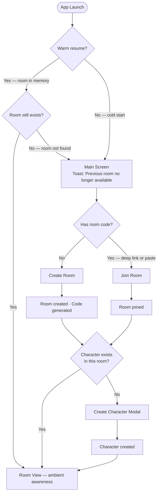
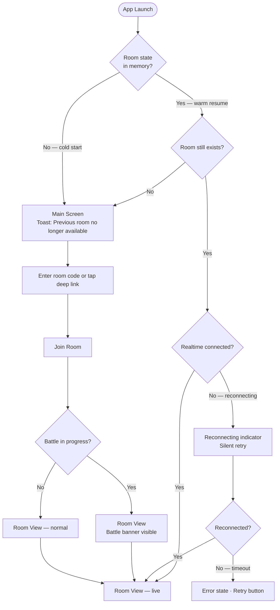
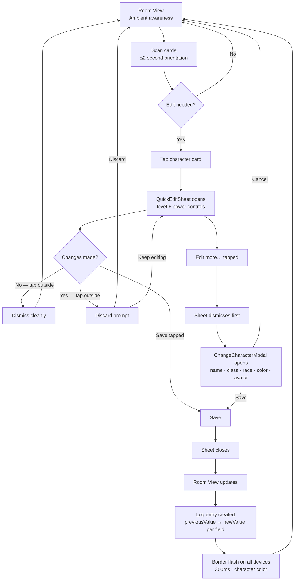
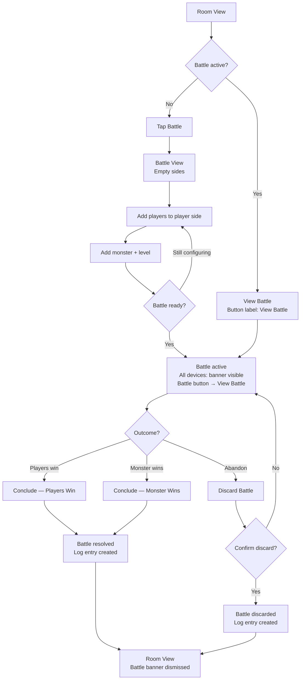

# UX Design Specification munch-helper

**Author:** Ivan
**Date:** 2026-03-22

---

<!-- UX design content will be appended sequentially through collaborative workflow steps -->

## Executive Summary

### Project Vision

Munch Helper is a lightweight shared-state companion for live Munchkin sessions. Its value is not replacing the physical game — it's removing the bookkeeping, visibility, and coordination friction that slows a real table down. The current phase is completion: making the existing room, character, battle, and log loop dependable enough to recommend for a real session.

### Target Users

Small groups (2–6 players) playing Munchkin in person, using iOS or Android phones as a secondary tool while engaging with physical cards and each other. Users are casually tech-savvy and interact with the app frequently but briefly, in a social and often noisy setting. The physical game is primary; the app is a support layer.

### Core Flow

1. **Identity** — User profile created anonymously or named, persisted locally and reconciled with the backend on startup.
2. **Room entry** — Create a room (generates a friendly code) or join via code. A default character is automatically created for the joining user.
3. **Character management** — Any player can create, update, or modify any character in the room. Each player sees which character is associated with them via a visual indicator ("You" label or equivalent). Editing is open and intentional — no permission gates.
4. **Battle** — Any player can start, manage, or conclude a battle. No battle owner. One active battle at a time per room. Discard requires confirmation.
5. **Logs** — Character creation/update events and battle summaries are available in a log view, with the ability to drill into finished battles.
6. **Session continuity** — Cold start (app fully closed) opens the Main screen. Warm resume (app backgrounded or tab switched) returns directly to the Room screen.

### Key Design Challenges

1. **Frictionless room entry** — Cold launch to seated-in-a-room must feel instant. Create/join plus auto character creation cannot feel like a setup wizard.
2. **Speed over depth during play** — Every interaction must be fast and purposeful. Players are mid-game, handling cards, and talking simultaneously.
3. **Battle complexity on a small screen** — Two sides, modifiers, multiple characters, live result. The hardest design problem in the product.
4. **Shared state coherence** — Realtime WebSocket updates must surface clearly without interrupting a player mid-action. Conflict legibility (not prevention) is the goal — last write wins, but the saved state must be visually obvious.
5. **Session continuity vs. bootstrap re-entry** — Warm resume must skip the default character creation bootstrap. Two entry paths (initial join, warm resume) must converge on the same room state.
6. **Concurrent character editing** — Multiple players can edit any character simultaneously. No permission UI needed; brief update cues (e.g. a "updated" flash) make the outcome legible.

### Design Opportunities

1. **The "war room" moment** — The Room View is a shared live scoreboard. Designing it as a glanceable panel rather than a scrollable list creates immediate session value.
2. **"Yours is highlighted, others are editable"** — The ownership indicator is purely visual and informational, never a gate. This creates a friendly shared-accountability feel consistent with the Munchkin spirit.
3. **Battle as a shared climax** — The Battle View is the peak moment of every turn. Real-time updates across both sides, with a clear result state, can be a standout experience.
4. **Character card as identity** — Name, avatar, color, and level make each player's character visually distinct. Expressive character cards add personality to a functional tool.
5. **Log as session memory** — Low effort to design, high value to players. Leaning into a narrative feel (level-ups, battle outcomes) gives the log view emotional resonance.

## Core User Experience

### Defining Experience

The core experience of Munch Helper is **ambient awareness** — every player, on their own device, has a complete and live picture of the room at all times without asking anyone. The product is not a scorekeeper operated by one person; it is a true peer model where every phone is a full first-class participant with complete read and write access.

The make-or-break moment is the **2-second room orientation**: a player picks up their phone mid-session and immediately understands everything — who has what level, who is in a battle, what changed. If they have to ask out loud, the app has failed.

The most critical interaction to get right is not any single tap — it is the Room View read. Stat editing is frequent; room reading is constant.

### Platform Strategy

- **Primary platforms:** iOS and Android (Expo/React Native), touch-first
- **Web:** Secondary export target; not a design priority
- **Key platform constraint:** Multi-screen simultaneity — 2 to 6 phones held simultaneously in close physical proximity. Every screen is someone's primary screen. Design decisions on font size, contrast, information density, color coding, and update visibility must account for legibility across all devices at once, including in poor lighting conditions.
- **No offline mode** — out of scope; realtime sync is a hard dependency, not an enhancement.
- **WebSocket is the product** — realtime synchronization is what makes the experience work. Without it, six independent editors create chaos instead of clarity.

### Effortless Interactions

- **Room state consumption** — reading the room should require zero cognitive effort. The Room View must be so well organized that players absorb information passively without consciously using the app.
- **Character identification** — color + avatar creates a visual namespace per player. Any player should be able to locate any character on any phone instantly.
- **Warm resume** — switching back to the app mid-session returns players to exactly where they were, with live state already loaded.
- **Realtime updates** — stat changes propagate silently across all devices. Players should never need to refresh or ask someone to update their phone.
- **Auto character creation** — joining a room creates your character automatically. No setup step before you can participate.

### Critical Success Moments

1. **The 2-second orientation** — Player picks up phone mid-session and immediately understands full room state. This is the primary success metric for the Room View.
2. **First room entry** — From cold launch to sitting in a room with a character feels instant, not like a setup flow. This is the first impression of the product.
3. **Stat update propagation** — Player A changes their level; Player B sees it on their phone without touching anything. This is the moment the product earns trust.
4. **Battle conclusion** — Battle is concluded by any player; result is immediately visible and resolved on all screens. The conclude action becomes visually unavailable, preventing double-taps. This is the climax payoff of the battle flow.

### Experience Principles

1. **Ambient over active** — The best interactions are ones users don't notice. Design the Room View to be absorbed, not operated.
2. **Peer parity** — Every player has the same access, the same view, and the same agency. No coordinator, no passive observers.
3. **Live by default** — State is always current. Loading states and stale data are failures, not acceptable UX states.
4. **Speed at the table** — Players are mid-game, mid-conversation, mid-chaos. Every flow must complete in the fewest possible taps with no hesitation moments.
5. **Legible across six screens** — Every design decision must hold up on a phone held across a table in a dimly lit room, not just in a design tool at 100% zoom.

## Desired Emotional Response

### Primary Emotional Goals

- **Confidence at entry** — Players feel immediately ready: "I'm in, I'm set up, I'm ready." Zero anxiety about whether the room join worked or the character exists.
- **Calm control during play** — The app quietly supports the session without demanding attention. Players feel aided, not managed. The app fades into the table.
- **Trust in the system** — Realtime updates and persistent state make players feel the app is reliable. They stop wondering "is this up to date?" and just play.

### Emotional Journey Mapping

| Moment | Desired feeling | Failure feeling to avoid |
|---|---|---|
| First launch / room entry | Confidence, readiness | Confusion, setup anxiety |
| Room View mid-session | Calm, ambient awareness | Overwhelm, information noise |
| Realtime stat update arrives | Quiet delight ("it just updated") | Surprise or distrust ("wait, did that change?") |
| Editing a character stat | Effortless control | Friction, fear of mistakes |
| During a battle | Excitement + clarity | Calculation anxiety, confusion about result |
| Something goes wrong (network, conflict) | Trust ("it handled it") | Frustration, mystery, silent failure |
| Warm resume mid-session | Continuity ("I'm right back") | Disorientation, reload anxiety |
| Cold start | Clean intentionality | Confusion about where to go |

### Micro-Emotions

- **Confidence over confusion** — Every screen state must be immediately legible. No orphan states, no "what do I do here?" moments.
- **Trust over skepticism** — Realtime updates should feel reliable enough that players stop verifying the app's state out loud.
- **Delight over mere satisfaction** — The first time a stat update silently appears from another player should feel like a small magic trick. Not a feature — a moment.
- **Belonging over isolation** — Character color and avatar make each player's presence felt, even when they're not the one currently editing.

### Design Implications

- **Confidence → Clear entry flow** — Room creation/join with immediate character presence. No intermediate "waiting" states without feedback.
- **Calm control → Low-density Room View** — Characters as scannable cards, not a data table. Level and power prominent; secondary stats secondary.
- **Trust → Visible update cues** — Brief, non-blocking flash when a character is updated by another player. Subtle but present.
- **Delight → Realtime feel** — Avoid polling artifacts. Updates should appear smoothly, not jerk in. Animation budget is small but purposeful.
- **Trust during errors → Honest error states** — Network issues shown clearly with recovery path. Never a blank screen or silent stale state.

### Emotional Design Principles

1. **Invisible reliability** — The app earns trust by never surprising players with unexpected states. Consistency is more emotional than polish.
2. **Delight through precision** — Small moments of delight (a stat update, a battle result snapping into place) are more powerful than decorative animations.
3. **Social warmth** — Color, avatar, and the "You" indicator make each player feel *present* in the room, not just represented as a data row.
4. **Calm is a design output** — The Room View's job is to lower cognitive load, not raise engagement. A calm player is a trusting player.

## UX Pattern Analysis & Inspiration

### Inspiring Products Analysis

**Level Counter (allmunchkins.com) — "Simple but powerful level counter for Munchkin"**

The direct predecessor in this space. Users love it for two reasons:
- **Tactile stat changes** — incrementing and decrementing level and power feels direct, like a physical counter. No edit form, no explicit save step per increment.
- **Main screen = the product** — all characters are visible at once on the primary screen. Navigation is minimal because everything lives in one view. The data is the UI.

The tagline is a design brief: *simple but powerful*. Users have already been trained to expect directness for stat changes and glanceable completeness from the character view.

**Jackbox Party Games — Room entry and multiplayer onboarding**

The gold standard for low-friction social room entry:
- **Short, human-readable room codes** — 4–5 characters, displayed prominently, entered in seconds. No QR codes, no app handshake, no account required to join.
- **Zero-barrier join flow** — code entry → you're in the room. The entire onboarding is one step.
- **Instant confirmation** — the moment you're in, it's obvious. No "did it work?" hesitation.
- **Designed for party context** — phone as a handheld controller while attention is split between the screen and the people around you.

Key difference from Jackbox: Munch Helper's room code is not broadcast on a shared TV screen — it is typically **copy-pasted to a group chat** before or at the start of a session. This shifts the sharing UX from a read-aloud model to a clipboard model.

**Live collaborative tools (Figma, Google Docs) — Realtime edit propagation**

Not an aesthetic reference but a behavioral one. The key pattern: when someone else changes something, you see it update in real time — and you know it was external, not your own action. The attribution cue (cursor color, avatar) makes a live update feel like a feature rather than a glitch. In Munch Helper, character color serves the same purpose.

### Transferable UX Patterns

**From Level Counter:**
- **Single-tap stat increments** — Level and power changes should feel like tapping a physical counter. +/− buttons, immediate feedback, no modal confirmation for non-destructive changes.
- **Character overview as home** — The Room View is always the primary destination. Every action returns to it. No deep navigation hierarchy pulls players away.

**From Jackbox:**
- **One-tap copy + shareable deep link** — The room code should have a prominent copy-to-clipboard affordance always visible in the Room View header. A deep link (e.g. `munchhelper://join/MUNCH-4F7K`) is the ideal share format for group chat context: tap link → app opens → you're in the room.
- **Code format as implicit branding** — A prefixed short code (`MUNCH-XXXX`) stands out in a chat thread and communicates its purpose without explanation. The format itself signals "this is a room code for this app."
- **One-step join confirmation** — Code entry → Room View loads with character already present. No intermediate screen.

**From live collaborative tools:**
- **Realtime update signal using character color** — When another player's character is updated, a brief color pulse or border flash on that character's card (using the character's own existing color) signals an external change. Zero new design tokens: the character color namespace does double duty as the update attribution signal.

### Anti-Patterns to Avoid

1. **Stat editing as a form flow** — Routing level/power increments through an edit form + explicit save breaks the Level Counter directness contract.
2. **Buried or one-time room code** — The code must be accessible at any point during the session, not only at creation. Players join late; codes get lost in chat.
3. **Code-only sharing** — Raw code without a one-tap copy or deep link adds friction in the group chat context where paste-to-join is the expected flow.
4. **Account creation wall** — Requiring registration before joining a room kills Jackbox-style momentum. Anonymous entry is the right default.
5. **Silent realtime updates** — A stat changing with no visual signal feels like a glitch. Even a 300ms color flash is enough to make the update feel intentional.
6. **Character list as deep navigation** — Tapping a character should bring up edit controls close to the surface, not navigate away from the Room View entirely.

### Design Inspiration Strategy

**Adopt:**
- Single-tap +/− for level and power (Level Counter)
- Short prefixed room codes, always visible, with one-tap copy (Jackbox)
- Room View as permanent home — all navigation returns here (Level Counter)
- Deep link share format for group chat room invites (Jackbox adapted)
- Character color as realtime update signal (collaborative tools pattern)

**Adapt:**
- Level Counter's "main screen = product" → extended to live multi-player Room View with realtime WebSocket updates and "You" ownership indicator
- Jackbox's instant join confirmation → applied to the chat-paste context: link tap or code entry → room with character already present

**Avoid:**
- Jackbox's TV host / player screen split — Munch Helper is peer parity; every screen is equal
- Productivity tool aesthetic — the behavioral patterns (live updates, attribution cues) are transferable; the visual language is not

## Design System Foundation

### Design System Choice

**Custom design system — consolidate and extend the existing `AppTheme`.**

The frontend already has an established custom design system built on React Native `StyleSheet` with a defined token set in `constants/theme.ts`. No third-party UI library is in use and none should be introduced. The correct path for this phase is:
1. **Consolidate first** — pull all hardcoded color values in existing components into `AppTheme` tokens before building new screens.
2. **Extend second** — build new screens (battle, log) entirely from `AppTheme` tokens with zero hardcoded hex values.

### Rationale for Selection

- The existing dark warm palette (`#3C3636` background, `#D4C26E` gold accent) already establishes a strong visual identity appropriate for a game companion — bold, warm, and legible in low light.
- Battle and Log buttons are already stubbed in the Room View (`opacity: 0`, marked TODO). New screens must feel native to the existing visual language.
- Introducing a third-party design system at this stage would require re-skinning existing screens — scope not warranted for a brownfield completion phase.
- All required primitives are already installed: `expo-haptics` for tactile stat feedback, `expo-clipboard` for room code sharing, `react-native-reanimated` for update animations.

### Implementation Approach

**Phase 1 — Consolidation (in scope, prerequisite):**

Migrate all hardcoded values in existing components into `AppTheme` tokens. Specifically:
- `VioletButton`: `#6E6BD4` → `AppTheme.colors.actionSecondary`
- `RoomCharacterCard`: `#A67560` → `AppTheme.colors.surfaceWarm`
- `[roomNumber].tsx` `logButton`: `#353535` → `AppTheme.colors.surfaceSubtle`
- Any remaining per-screen `COLORS` constants → corresponding `AppTheme` tokens

After consolidation, `AppTheme` is the single unambiguous reference for all new component work.

**Phase 2 — Extension (new screens):**

All new components (battle view, log view, stat controls, room code display) use `AppTheme` tokens exclusively. No hardcoded values in new code.

### Customization Strategy

**Tokens to add to `AppTheme.colors`:**

| Token | Value | Role |
|---|---|---|
| `actionSecondary` | `#6E6BD4` | Violet — secondary action buttons |
| `surfaceWarm` | `#A67560` | Warm brown — card-style surfaces |
| `surfaceSubtle` | `#353535` | Dark grey — muted surface (log button) |

Token naming is **role-based, not component-specific** — `surfaceWarm` applies to any warm card surface, not only the character card. This prevents per-component token proliferation as new screens are added.

**New component patterns for new screens:**

- **Stat increment controls (+/−):** Large tap targets (min 44×44pt), `Haptics.ImpactFeedbackStyle.Light` on every tap via `expo-haptics` *(required behavior, not optional polish)*, immediate visual feedback, no save confirmation for non-destructive increments.
- **Room code display:** `AppTheme.colors.accent` (`#D4C26E`) for code text, copy-to-clipboard icon inline via `expo-clipboard`, always visible in Room View header.
- **Realtime update signal:** Border color interpolation on the updated character card using that character's own color value — fade in → hold 100ms → fade out over 300ms total, via `react-native-reanimated`. Border only (not background) to avoid layout repaints and support concurrent multi-card updates without visual conflict. Scale pulse (`1.0 → 1.03 → 1.0`) deferred to post-launch iteration.
- **Battle view sides:** `AppTheme.colors.danger` (`#922525`) for monster side, `AppTheme.colors.accent` (`#D4C26E`) for player side.
- **Destructive actions (Discard Battle):** `AppTheme.colors.danger` with explicit confirmation step before execution.

---

## 7. Defining Core Experience

### 7.1 Defining Experience

The defining experience of munch-helper is the **Room View → Character Modal → Save loop**:

> "Tap any character card → edit stats in a focused modal → save → room updates for everyone."

Every successful Munchkin session will involve this loop dozens of times. If this interaction is effortless, the whole product feels right. The Room View is a live awareness layer — a dashboard. The Character Modal is the action layer — a cockpit. The transition between them is the experience heartbeat of every session.

### 7.2 User Mental Model

Users come from two reference points:
- **Physical stat tracking** (pen, paper, tokens) — chaotic, error-prone, authoritative only if you're watching
- **Level Counter** — familiar +/− button controls, character-centric main screen

They expect: tap a thing, change a number, be done. They don't want to think about "did that save?" — but they do want an explicit confirmation before a stat is committed, because changes are intentional, not casual (once or twice per turn, not continuous).

The character name visible in the modal header is sufficient context — no ownership labelling needed. All characters are editable by all players, symmetrically.

### 7.3 Success Criteria

- Room View: full room state (all characters, levels, gear) legible in **≤ 2 seconds**
- Character modal: tap card → modal open in **< 300ms** (feels instant)
- Stat change + save: **3 taps or fewer** (tap card → tap +/− → tap Save)
- After save: modal closes, Room View updates, border flash fires on all devices
- New player can discover how to update their level within **30 seconds** of joining

### 7.4 Novel vs. Established Patterns

Combining established patterns innovatively:
- **Established**: bottom sheet / modal editor (familiar mobile pattern)
- **Established**: tap-to-open card interaction
- **Established**: explicit Save button for intentional edits
- **Novel twist**: realtime border flash signal on Room View cards (zero new UI tokens — uses character's own color)
- **Novel twist**: full peer edit access with no permission gates — any player edits any character

No user education required. The patterns are immediately legible to any smartphone user.

### 7.5 Experience Mechanics

**1. Initiation**
User taps any character card on the Room View. No long-press, no edit button — tap is the universal entry.

**2. Interaction**
Character Modal slides up (bottom sheet). Header shows character name. Controls: +/− for Level, Power, and any other tracked stats. All controls use `Haptics.ImpactFeedbackStyle.Light` on every tap — tactile confirmation is required behavior.

**3. Feedback**
- Stat numbers update instantly on tap (optimistic local update)
- Haptic pulse on every +/−
- Save button becomes active once any change is made
- Tap outside with no changes → dismiss cleanly
- Tap outside with unsaved changes → lightweight "Discard changes?" prompt (not a blocking modal-on-modal)

**4. Completion**
User taps Save → modal closes → Room View reflects updated stats → border color flash fires on the updated character card across all connected devices (300ms, character's own color, via `react-native-reanimated`).

---

## 8. Visual Foundation

### 8.1 Color System

Built on the existing `AppTheme` (source of truth: `frontend/constants/theme.ts`). No new colors introduced beyond the extension tokens from Step 6, plus one addition from visual hierarchy discovery.

**Base palette:**

| Token | Value | Role |
|---|---|---|
| `background` | `#3C3636` | App background — dark warm |
| `surface` | `#473F3F` | Default card/surface |
| `elevated` | `#4C4545` | Raised surfaces (modals, sheets) |
| `accent` | `#D4C26E` | Gold — stat values + primary affordance |
| `danger` | `#922525` | Destructive actions, monster side |
| `textPrimary` | `#FFFFFF` | Primary text |
| `textMuted` | `#D9D9D9` | Secondary/caption text |

**Extension tokens (to add to `AppTheme.colors`):**

| Token | Value | Role |
|---|---|---|
| `actionSecondary` | `#6E6BD4` | Violet — secondary action buttons |
| `surfaceWarm` | `#A67560` | Warm brown — character card surface |
| `surfaceSubtle` | `#353535` | Dark grey — muted surfaces |
| `textAccentSoft` | `#E8D89A` | Soft gold — character names on cards and modal header |

**`accent` usage rule:** `#D4C26E` is reserved for exactly two purposes — (1) numerical values the player cares most about (level, Power stat values), and (2) the primary actionable element on any given screen. Using `accent` outside these contexts dilutes its signal value.

`textAccentSoft` (`#E8D89A`) is the desaturated sibling — used for character names. Close enough to `accent` to read as family; muted enough that full-strength stat numbers dominate in vibrancy.

### 8.2 Typography System

System fonts only for this phase — SF Pro (iOS) and Roboto (Android), resolved automatically by React Native. Zero bundle size cost, native rendering quality.

**Type scale:**

| Role | Size | Weight | Color | Usage |
|---|---|---|---|---|
| `displayLarge` | 32pt | 700 | `accent` | Room code display |
| `heading1` | 22pt | 700 | `textPrimary` | Screen titles |
| `heading2` | 18pt | 600 | `textAccentSoft` | Character name in modal header |
| `statNumberLarge` | 28pt | 700 | `accent` | Level/Power values in modal |
| `statNumberCard` | 20pt | 700 | `accent` | Level/Power values on Room View cards |
| `cardName` | 15pt | 700 | `textAccentSoft` | Character name on Room View card |
| `body` | 15pt | 400 | `textPrimary` | General content |
| `caption` | 12pt | 400 | `textMuted` | Labels, secondary info |

**Card hierarchy principle:** Name (`cardName`) and stat values (`statNumberCard`) are visual equals — same approximate weight, both warm gold tones. Name uses `textAccentSoft`, stats use full `accent`. Partners, not headline and subhead.

### 8.3 Spacing & Layout Foundation

Existing spacing tokens retained, one addition:

| Token | Value |
|---|---|
| `xs` | 4pt |
| `sm` | 8pt |
| `md` | 12pt |
| `lg` | 16pt |
| `xl` | 24pt |
| `xxl` | 32pt *(new — modal horizontal padding)* |

**Room View layout — compact 2-column grid:**
- `FlatList` with `numColumns=2`, column count as named constant
- Outer horizontal padding: `lg` (16pt) each side
- Gutter between columns: `lg` (16pt)
- Card internal padding: `md` (12pt)
- Grid math (375pt screen): 375 − 32 (outer) − 16 (gutter) = 327pt ÷ 2 ≈ **163pt per card** — SE-safe
- Room code header: sticky `ListHeaderComponent` above `FlatList` — always visible, always copyable during scroll

**Character Modal layout:**
- Bottom sheet, `elevated` background (`#4C4545`)
- `xxl` (32pt) horizontal padding
- `lg` (16pt) vertical rhythm between stat rows
- Stat row: `caption` label + `statNumberLarge` value + −/+ controls
- Minimum touch target: 44×44pt on all interactive elements
- Save button: full-width, `accent` background, pinned to bottom of sheet

**Density principle:** Compact but complete — maximum useful information per screen, no stat omitted from cards, no scrolling required for ≤4 players.

### 8.4 Accessibility Considerations

- **Contrast**: `textPrimary` white on `background` `#3C3636` ≈ 9:1 — exceeds WCAG AA (4.5:1 required)
- **Soft gold contrast**: `textAccentSoft` `#E8D89A` on `surface` `#473F3F` ≈ 7:1 — passes AA
- **Touch targets**: all interactive controls minimum 44×44pt
- **Color independence**: stat labels (`caption`) always accompany values — no color-only encoding
- **Haptics**: `Light` impact on every +/− provides tactile confirmation layer
- **Realtime signals**: border flash is supplementary — Room View stat values are always the ground truth

---

## 9. Design Direction Decision

### 9.1 Directions Explored

Three directions evaluated against actual frontend code (`RoomCharacterCard`, `RoomCharactersList`, `ChangeCharacterModal`, `CurrentCharacterFooter`):

- **D1 — As-Is**: Current implementation baseline — surfaceWarm cards, white text, "Change" button per card, centered full-editor modal, room number in nav title only
- **D2 — Refined**: Same horizontal card structure, design tokens applied, sticky room code header, two-tier modal (bottom sheet for quick edits → full modal for advanced)
- **D3 — Compact Grid**: 2-column compact cards, no attributes box, tap-to-open bottom sheet only

### 9.2 Chosen Direction: D2 — Refined

The horizontal card layout is retained. The attributes box (race/class/gender) remains visible on every card — players need this information at a glance during gameplay (card interactions depend on race and class). Hiding it behind a tap would create real friction multiple times per session.

### 9.3 What Changes from Current

| Component | Current | Refined |
|---|---|---|
| `characterNickname` color | `#FFFFFF` (hardcoded) | `textAccentSoft` `#E8D89A` |
| `characterStats` color | `#FFFFFF` (hardcoded) | `accent` `#D4C26E` |
| Room code | Nav bar title only | Sticky header + copy-to-clipboard |
| Edit trigger | "Change" button only | Full card tap + "Change" button |
| Edit modal | Centered full editor (always) | Two-tier: bottom sheet (quick) → full modal (advanced) |
| `CurrentCharacterFooter` bg | `#544C4C` (hardcoded) | `AppTheme.colors.elevated` `#4C4545` |

### 9.4 Two-Tier Edit Pattern

**Quick path** (bottom sheet — used every turn):
Level +/− and Power +/− controls with Save button. Covers ~90% of in-game edits. Triggered by tapping anywhere on the character card.

**Full path** (centered modal — used rarely):
"Edit more…" link at the bottom of the sheet routes to the existing `ChangeCharacterModal` for name, class, race, gender, avatar, and color changes. These happen at most once per session.

This pattern maps directly to usage frequency — stats change every turn, attributes change rarely.

### 9.5 Design Rationale

Direction 2 is the minimum-viable visual improvement: no structural rebuild of existing components, focused token adoption, and a meaningful UX upgrade to the edit flow. The attributes box is load-bearing UX — it surfaces race and class that players need to resolve card interactions mid-game without opening a modal.

### 9.6 Implementation Approach

1. Update `RoomCharacterCard` — apply `textAccentSoft` to name, `accent` to stat values
2. Update `CurrentCharacterFooter` — align background to `AppTheme.colors.elevated`
3. Add room code sticky header to `[roomNumber].tsx` (above `RoomCharactersList`) with copy-to-clipboard via `expo-clipboard`
4. Create `QuickEditSheet` component — bottom sheet with level/power +/− controls, Save, and "Edit more…" link
5. Wire `onChangePress` to full card `onPress` in addition to the existing "Change" button
6. "Edit more…" in `QuickEditSheet` closes sheet and opens existing `ChangeCharacterModal`

---

## 10. User Journey Flows

### 10.1 Journey 1 — Session Start

**Who:** Any player (Marta, Nina, Alex on first open)



---

### 10.2 Journey 2 — Mid-Session Join / Resume

**Who:** Alex — joins late or reconnects after interruption



---

### 10.3 Journey 3 — Room View Loop (Defining Experience)

**Who:** Every player, every turn



---

### 10.4 Journey 4 — Battle Lifecycle

**Who:** Any player initiates; battle belongs to the room — any connected player can manage it



---

### 10.5 Log Entry Format

All log entries record both sides of every change:

```
{ field, previousValue, newValue, characterId, characterName, timestamp }
```

**Rendered as:** `Thrognar: Level 7 → 8` · `Zara: Power 4 → 9` · `"Bork" → "Bork the Mighty"`

Applies to:
- Stat saves from QuickEditSheet (level, power)
- Full modal saves (name, class, race, gender, color, avatar)
- Battle events (started, concluded — players win / monster wins, discarded)

---

### 10.6 Journey Patterns

| Pattern | Rule |
|---|---|
| **Entry** | Cold start → Main Screen; warm resume → Room View (with room-exists check) |
| **Edit** | Tap card → quick sheet → save → log entry + border flash |
| **Modal transition** | Sheet dismisses *before* full modal opens — sequential, not simultaneous |
| **Destructive** | Confirm before discard (battle only); stat edits are non-destructive |
| **Recovery** | Silent reconnect retry → visible indicator only on timeout → retry button |
| **Battle ownership** | Battle belongs to the room — any connected player manages regardless of initiator |

### 10.7 Flow Optimization Principles

- **Minimum taps to value:** stat change in 3 taps (tap card → tap +/− → Save)
- **Log is automatic:** players never manually record — every save writes a log entry
- **No blocking states:** reconnect retries silently; battle in progress doesn't block room entry
- **Discard is gated:** confirmation only on destructive actions (battle discard)
- **Realtime is supplementary:** Room View always shows ground truth; flash is additive signal
- **Battle is stateless for players:** anyone picks up where anyone left off

---

## 11. Component Strategy

### 11.1 Design System Coverage

No third-party UI library — pure React Native StyleSheet throughout. `AppTheme` (extended per Step 6) is the sole design token source. All components use `StyleSheet.create` with `AppTheme` token references.

### 11.2 Existing Components (Update Required)

| Component | File | Changes |
|---|---|---|
| `RoomCharacterCard` | `components/munchkin/RoomCharacterCard.tsx` | Apply `textAccentSoft` to name, `accent` to stat values, wire `useRealtimeFlash`, make full card tappable |
| `CurrentCharacterFooter` | `components/munchkin/CurrentCharacterFooter.tsx` | Apply same token updates, align bg to `AppTheme.colors.elevated` |
| `VioletButton` | `components/VioletButton.tsx` | Replace hardcoded `#6E6BD4` with `AppTheme.colors.actionSecondary` |
| `[roomNumber].tsx` | `app/munchkin/[roomNumber].tsx` | Wire `RoomCodeHeader`, `ActiveBattleBanner`, Battle/Log screen navigation, unhide action buttons |

### 11.3 New Screens

**`app/munchkin/[roomNumber]/(battle)/index.tsx` — Battle Screen**
- Full Expo Router stack push from Room View
- Back button pops to Room View (standard stack behaviour)
- Battle state is room-level (server), safe to navigate away and return
- Entry points: Battle button (no active battle) or "View Battle" via `ActiveBattleBanner`

**`app/munchkin/[roomNumber]/log.tsx` — Log Screen**
- Full Expo Router stack push from Room View
- Renders scrollable list of `LogEntry` components
- Ordered newest-first
- Entry point: Log button on Room View

### 11.4 New Reusable Components

---

**`RoomCodeHeader`**
- **Purpose:** Sticky room identification + share affordance, always visible
- **Anatomy:** Room label (caption) · room code (displayLarge, accent) · Copy button (copy-to-clipboard via `expo-clipboard`)
- **Placement:** `ListHeaderComponent` of `RoomCharactersList` FlatList — stays pinned during scroll
- **States:** Default · Copied (button briefly shows "Copied ✓")
- **Tokens:** `elevated` bg, `accent` code text, `caption` label

---

**`QuickEditSheet`**
- **Purpose:** Fast level/power edit without opening the full modal — covers ~90% of in-game edits
- **Anatomy:** Handle · character name (heading2, textAccentSoft) · Level row (+/−, statNumberLarge, accent) · Power row (+/−, statNumberLarge, actionSecondary) · Save button (full-width, accent) · "Edit more…" link (caption, textMuted)
- **Trigger:** Tap anywhere on `RoomCharacterCard`
- **States:** Clean (no changes) · Dirty (changes pending, Save active) · Saving (brief loading state)
- **Dismiss:** Tap outside with no changes → dismiss; tap outside with changes → Discard prompt
- **Transition:** "Edit more…" → sheet dismisses first → `ChangeCharacterModal` opens (sequential, never simultaneous)
- **Haptics:** `Light` impact on every +/− tap (required)
- **Implementation note:** `Modal transparent={true}` + `Animated.spring` bottom sheet — pure React Native, no third-party sheet library

---

**`ActiveBattleBanner`**
- **Purpose:** Persistent awareness signal on Room View when a battle is active; navigation entry to Battle screen
- **Anatomy:** ⚔️ icon · "Battle in progress" label · "View Battle →" action text
- **Placement:** Between `RoomCodeHeader` and character list — always visible when battle active, absent otherwise
- **States:** Visible (battle active) · Hidden (no battle)
- **Persistence:** Survives in-session navigation — does not dismiss on tab switch or app background
- **Tokens:** `danger` background (`#922525`), `textPrimary` text

---

**`LogEntry`**
- **Purpose:** Single row in the Log screen representing one session event
- **Anatomy:** Small character avatar (24×24, character color bg) · character name (body, textAccentSoft) · field label (caption, textMuted) · `prev → new` value (body bold, accent) · timestamp (caption, textMuted, right-aligned)
- **Variants:** Stat change · Battle event (started / concluded / discarded) · Character created
- **States:** Default only — log entries are immutable
- **Example renders:**
  - `[T] Thrognar · Level · 7 → 8 · 3m ago`
  - `[Z] Zara Swift · Power · 4 → 9 · 12m ago`
  - `⚔️ Battle · Players Win · 8m ago`

---

**`ReconnectingBanner`**
- **Purpose:** Non-blocking indicator that realtime connection is restoring
- **Anatomy:** Spinner · "Reconnecting…" label · silent auto-dismiss on reconnect
- **Placement:** Top of screen, below status bar — overlays content, does not push layout
- **States:** Visible (reconnecting) · Timeout (shows "Connection lost · Retry" with tap action) · Hidden
- **Tokens:** `surfaceSubtle` bg, `textMuted` text — intentionally low-prominence

---

### 11.5 New Hook

**`useRealtimeFlash(color: string)`**
- **Purpose:** Animated border highlight on `RoomCharacterCard` when another player updates that character's stats
- **Behaviour:** Border interpolates from transparent → `color` → transparent over 300ms via `react-native-reanimated`
- **Trigger:** Called externally when a realtime update arrives for the character's ID
- **Returns:** `animatedBorderStyle` — applied directly to card's border style
- **Constraints:** Border only (not background) — avoids layout repaints and supports concurrent multi-card flashes without visual conflict

### 11.6 Implementation Roadmap

**Phase 1 — Core session loop (unblocks live use):**
1. `RoomCodeHeader` — room entry confidence
2. `QuickEditSheet` — the defining experience
3. `useRealtimeFlash` — realtime signal
4. Token updates to `RoomCharacterCard`, `CurrentCharacterFooter`, `VioletButton`

**Phase 2 — Battle and Log (completes PRD promise):**
5. `ActiveBattleBanner`
6. `battle/[roomNumber].tsx` — Battle screen
7. `log/[roomNumber].tsx` — Log screen
8. `LogEntry` component

**Phase 3 — Resilience:**
9. `ReconnectingBanner`
10. Warm resume room-not-found recovery path

---

## 12. UX Consistency Patterns

### 12.1 Button Hierarchy

**Rule:** Never more than one primary action visible at a time per layer (card, sheet, screen).

| Tier | Style | Token | Usage |
|---|---|---|---|
| Primary | Full-width, dark text | `accent` (#D4C26E) bg | One per layer — Save in QuickEditSheet, Start/Resolve in Battle screen |
| Secondary | Standard button, white text | `actionSecondary` (#6E6BD4) bg | VioletButton — "Change", "View Battle" in ActiveBattleBanner |
| Destructive | Standard button, white text | `danger` (#922525) bg | Discard changes, Forfeit battle |
| Ghost | No background, caption size | `textMuted` text | "Edit more…" in QuickEditSheet — available but not the recommended next step |
| Disabled | No background | `surfaceSubtle` bg + `textMuted` text | Saving state in QuickEditSheet; visually inert, not gold — prevents confusion with active accent |

### 12.2 Feedback Patterns

**Optimistic updates:** Stat value updates immediately in the UI on local tap (before server confirmation). `useRealtimeFlash` fires on server confirmation — the flash serves as visual acknowledgement. On server error: revert value quietly with a brief border flash in `danger` color. No toast for errors on stat changes.

**Haptic confirmation:** `Haptics.ImpactFeedbackStyle.Light` on every stat +/− tap. Fires immediately, before save — confirms the tap was registered. Required, not optional.

**Save confirmation:** No toast. The local optimistic update + realtime flash sequence is the confirmation signal.

**Clipboard copy:** Inline state change on RoomCodeHeader — "Copy" → "Copied ✓" for 1500ms, then resets. No toast.

**Reconnecting state:** `ReconnectingBanner` top-of-screen, low-prominence (`surfaceSubtle` bg, `textMuted` text). Auto-dismisses on reconnect. Escalates to "Connection lost · Retry" button after 8s timeout.

**Field error:** `danger` border tint on the errored field + short inline label below. Never a blocking modal for a field-level error.

### 12.3 Modal & Overlay Patterns

| Layer | Component | Presentation | Dismiss |
|---|---|---|---|
| Bottom sheet | `QuickEditSheet` | Slides up from bottom (~60% screen height) | Tap outside (undo toast if dirty), swipe down |
| Full modal | `ChangeCharacterModal` | Centered full-screen overlay | Explicit close button only |
| Screen | Battle / Log | Expo Router stack push | Back chevron (standard stack header) |
| Banner | `ActiveBattleBanner` | Inline strip in list header | Not dismissible — reflects live server state |

**Stacking rule:** `QuickEditSheet` and `ChangeCharacterModal` are never open simultaneously. Enforced via `isSheetOpen` state gate — modal open is blocked until sheet's `onDismiss` callback fires. Prevents race condition on slow devices.

**Dirty state dismiss:** No blocking confirmation prompt (disruptive in tabletop context). Instead: accidental dismiss triggers a brief **Undo toast (1500ms)** at bottom of screen. Tap "Undo" restores previous sheet state. Toast auto-expires silently if ignored.

### 12.4 Form Patterns

**Stepper inputs (+/−):**
- Tap target: **entire button container** minimum 44×44pt — not just the label text
- Haptic: `Light` impact on every tap
- Display: current value between the two buttons, bold, `accent` color
- Floor: 0 (value cannot go negative)
- Ceiling: TBD — standard Munchkin caps Level at 10, Power at 9; enforce once confirmed by product

**Picker inputs (class/race):**
- Scroll-type picker, always shows current value
- Full text labels — no icon-only

**Text inputs (character name):**
- `autoCapitalize="words"`, `autoCorrect={false}`

**Validation timing:** On Save tap, not on blur — mid-edit interruption is disruptive in a noisy environment.

### 12.5 Navigation Patterns

Currently single-stack. Battle and Log are accessed via push navigation from Room View — a descriptive constraint of the current scope, not a permanent architectural rule.

| Pattern | Component | Mechanism |
|---|---|---|
| Stack push | Battle screen, Log screen | Expo Router `router.push()` |
| Bottom sheet | QuickEditSheet | Local component state, not a route |
| Full modal overlay | ChangeCharacterModal | Existing Expo Router modal route |

### 12.6 Empty & Loading States

| State | Screen | Message | CTA |
|---|---|---|---|
| Empty character list | Room View | "No characters yet. Add yours to get started." | Primary button (host only) |
| Empty log | Log screen | "No events recorded yet." | None |
| Battle not started | Room View | No banner; Battle button label = "Battle" | — |
| Room loading | Room View | Full-screen spinner + "Loading room…" on `background` | Not interruptible |
| Room not found (warm resume) | — | Graceful fallback to Main Screen + toast | — |

---

## 13. Responsive Design & Accessibility

### 13.1 Responsive Strategy

**Platform context:** Expo + React Native, portrait-only, phones only. No tablet or desktop layout. Responsive means adapting to the phone size range from iPhone SE (375pt) to iPhone 16 Pro Max (430pt) and equivalent Android devices.

**Layout approach:** All layouts use `flex` and percentage widths — no hardcoded pixel widths. `FlatList` handles single-column character cards naturally. Portrait orientation is locked — landscape is impractical in a tabletop game context.

**Safe area handling:** `useSafeAreaInsets()` is applied at the **screen level** (`[roomNumber].tsx`, `battle/[roomNumber].tsx`, `log/[roomNumber].tsx`) — not inside individual components. Components receive their allocated space; they do not carve out safe area independently. This prevents double-inset compounding and keeps components reusable.

### 13.2 Screen Size Adaptation

| Element | SE (375pt) | Standard (390–414pt) | Notes |
|---|---|---|---|
| Character card height | 85pt | 85pt | Fixed — grid math works at all sizes |
| QuickEditSheet height | ~60% screen | ~60% screen | Percentage-based |
| `statNumberLarge` | 28pt | 28pt | Universal — no size variant |
| `RoomCodeHeader` padding | `md` (12pt) | `md`–`lg` (12–16pt) | Flex handles it |

**Minimum test target:** iPhone SE (375pt). If layout is correct at 375pt, it holds at all larger sizes.

### 13.3 Design Token Update

`surfaceWarm` is revised to `#8A6150` (darkened from `#A67560`) to improve contrast for `accent` text on character card backgrounds. This propagates to `RoomCharacterCard` and `CurrentCharacterFooter` background color.

### 13.4 Accessibility Strategy

**Target:** WCAG AA adapted for React Native mobile (iOS VoiceOver + Android TalkBack). Legal compliance is not a hard requirement, but accessibility is good game experience — colourblind players, low-light conditions, one-handed play.

**Contrast ratios:**

| Token pair | Ratio | Status |
|---|---|---|
| `textPrimary` on `background` (#FFF / #3C3636) | ~9.5:1 | ✅ AAA |
| `accent` on `background` (#D4C26E / #3C3636) | ~5.8:1 | ✅ AA |
| `accent` on `surfaceWarm` (#D4C26E / #8A6150) | ~4.2:1 | 🔶 Near-AA — mitigated by bold weight |
| `textMuted` on `surface` (#D9D9D9 / #473F3F) | ~5.2:1 | ✅ AA |
| `textMuted` on `elevated` (#D9D9D9 / #4C4545) | ~4.8:1 | ✅ AA |

**Contrast exception:** `accent` on `surfaceWarm` at ~4.2:1 is below AA (4.5:1) for normal text. Mitigated by: bold weight on all card stat values, `surfaceWarm` darkened from original, text shadow (`rgba(0,0,0,0.4)`) on character names. Accepted as near-AA on a decorative+functional element. Tracked as a known exception.

### 13.5 React Native Accessibility Props

| Component | Required accessibility props |
|---|---|
| `RoomCharacterCard` | `accessible={true}`, `accessibilityLabel="[Name], Level [N], Power [N]"`, `accessibilityRole="button"`, `accessibilityHint="Tap to edit stats"` |
| `RoomCodeHeader` Copy button | `accessibilityLabel="Copy room code [code]"`, `accessibilityRole="button"` |
| `QuickEditSheet` +/− buttons | `accessibilityLabel="Increase level"` / `"Decrease level"`, `accessibilityRole="button"` |
| `ActiveBattleBanner` | `accessibilityLabel="Battle in progress. Tap to view."`, `accessibilityRole="button"` |
| `LogEntry` | `accessibilityLabel="[Name], [field] changed from [prev] to [new], [time] ago"` |
| `ReconnectingBanner` | Use `AccessibilityInfo.announceForAccessibility(message)` called imperatively on banner mount — not `accessibilityLiveRegion` prop (cross-platform unreliable in React Native for non-focusable elements) |

### 13.6 Reduced Motion

Check `useReducedMotion()` from `react-native-reanimated`. When enabled:
- **`useRealtimeFlash`:** Skip border interpolation — apply border color immediately, remove after 300ms
- **`QuickEditSheet`:** Skip spring animation — snap directly to open/closed position
- No other animations are currently specified in the design

### 13.7 Colour Blindness

The `accent` gold (#D4C26E) is the most load-bearing colour token — stat values, primary actions, room code. Gold-to-brown collapse is a known risk under Deuteranopia and Protanopia.

**Mitigation already in place:** All accent-coloured elements pair colour with bold weight or a primary affordance shape (button, number). Colour is never the sole differentiator.

**Required test:** Run Xcode Accessibility Inspector colour filter (Deuteranopia + Protanopia) against Room View and QuickEditSheet before release.

### 13.8 Testing Strategy

**Device targets:**
- iPhone SE — minimum size validation
- iPhone 16 — standard iOS baseline
- Pixel 6a (or similar mid-range Android) — representative Android performance baseline; flagship devices mask jank that mid-range users experience

**Accessibility testing:**
- iOS VoiceOver: navigate Room View by swipe, trigger QuickEditSheet, verify all labels announced correctly
- Android TalkBack: same flow
- Colour contrast: Xcode Accessibility Inspector
- Colour blindness simulation: Deuteranopia + Protanopia filters in Xcode Inspector
