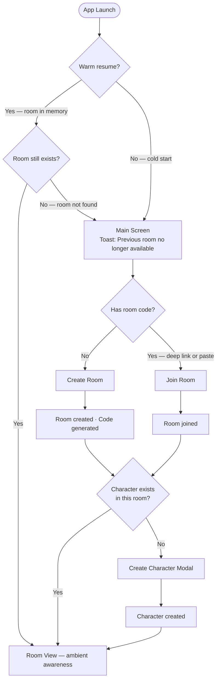
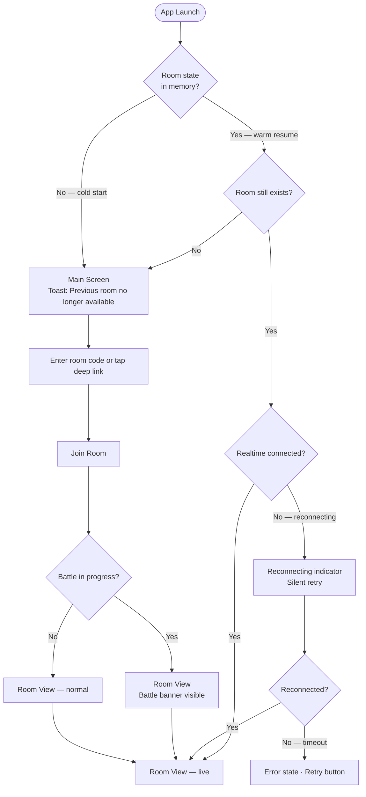
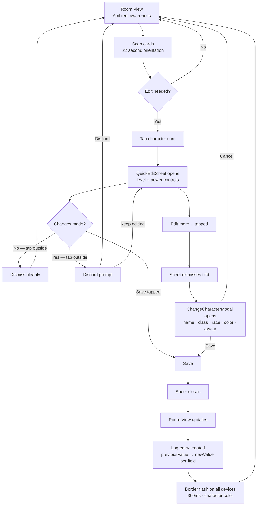
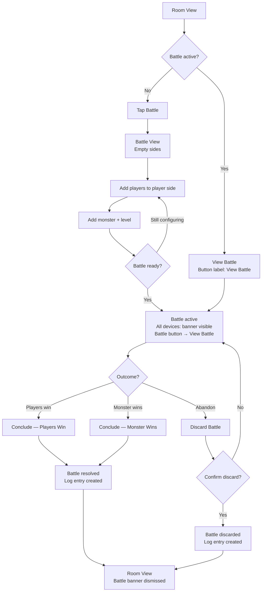

# 10. User Journey Flows

## 10.1 Journey 1 — Session Start

**Who:** Any player (Marta, Nina, Alex on first open)



---

## 10.2 Journey 2 — Mid-Session Join / Resume

**Who:** Alex — joins late or reconnects after interruption



---

## 10.3 Journey 3 — Room View Loop (Defining Experience)

**Who:** Every player, every turn



---

## 10.4 Journey 4 — Battle Lifecycle

**Who:** Any player initiates; battle belongs to the room — any connected player can manage it



---

## 10.5 Log Entry Format

All log entries record both sides of every change:

```
{ field, previousValue, newValue, characterId, characterName, timestamp }
```

**Rendered as:** `Thrognar: Level 7 → 8` · `Zara: Power 4 → 9` · `"Bork" → "Bork the Mighty"`

Applies to:
- Stat saves from QuickEditSheet (level, power)
- Full modal saves (name, class, race, gender, color, avatar)
- Battle events (started, concluded — players win / monster wins, discarded)

---

## 10.6 Journey Patterns

| Pattern | Rule |
|---|---|
| **Entry** | Cold start → Main Screen; warm resume → Room View (with room-exists check) |
| **Edit** | Tap card → quick sheet → save → log entry + border flash |
| **Modal transition** | Sheet dismisses *before* full modal opens — sequential, not simultaneous |
| **Destructive** | Confirm before discard (battle only); stat edits are non-destructive |
| **Recovery** | Silent reconnect retry → visible indicator only on timeout → retry button |
| **Battle ownership** | Battle belongs to the room — any connected player manages regardless of initiator |

## 10.7 Flow Optimization Principles

- **Minimum taps to value:** stat change in 3 taps (tap card → tap +/− → Save)
- **Log is automatic:** players never manually record — every save writes a log entry
- **No blocking states:** reconnect retries silently; battle in progress doesn't block room entry
- **Discard is gated:** confirmation only on destructive actions (battle discard)
- **Realtime is supplementary:** Room View always shows ground truth; flash is additive signal
- **Battle is stateless for players:** anyone picks up where anyone left off

---
