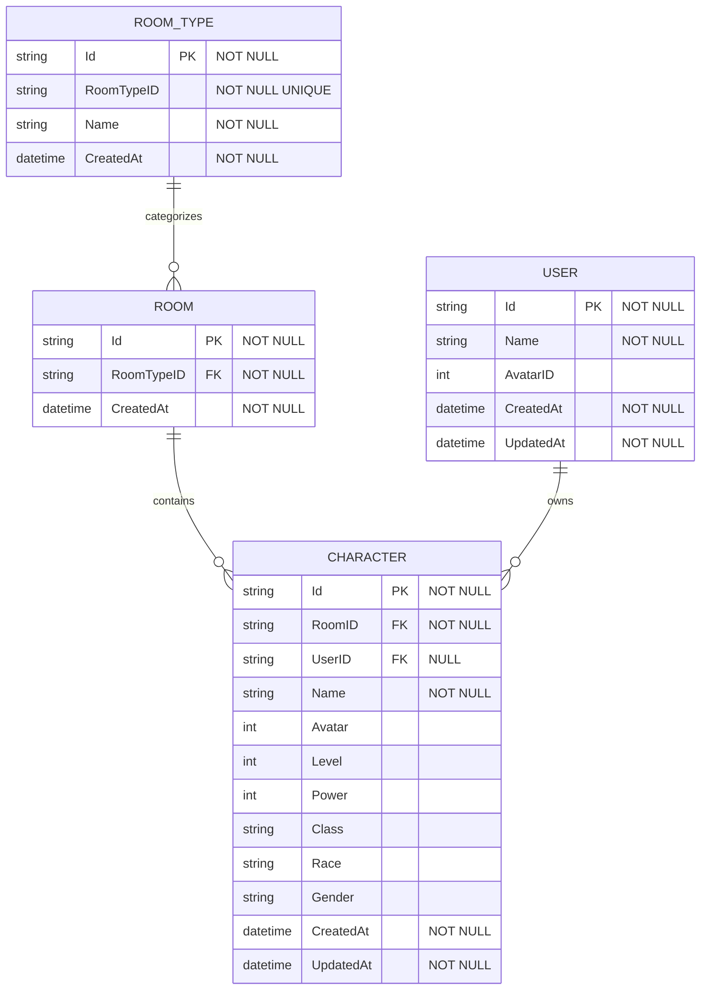
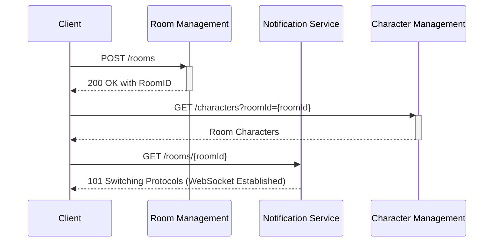
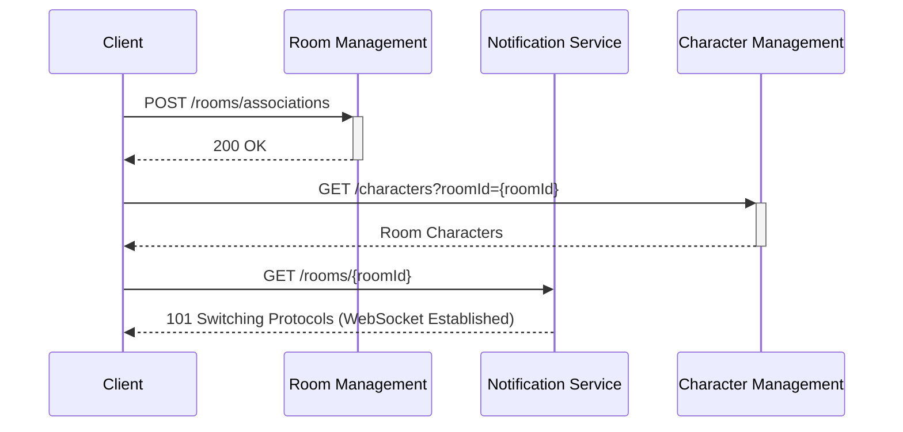

# Backend Services

# Services

[User Management](Backend%20Services/User%20Management.md)

[Room Management](Backend%20Services/Room%20Management.md)

[Room Notifications](Backend%20Services/Room%20Notifications.md)

[Character Management](Backend%20Services/Character%20Management.md)

# Tools and Technologies
- **Database**: DynamoDB (remote), MongoDB (local)
- **API Gateway**: AWS API Gateway HTTP API (remote), Nginx (local)
- **Backend Framework**: Express.js + AWS Lambda
- **WebSocket**: AWS Lambda with AWS API Gateway WebSocket API (remote), Socket.IO (local)
- **Messaging**: AWS SNS (remote), Redis Pub/Sub (local)

# Architecturally Significant Requirements (Implementation-Derived)

## Cross-Service API Contract and Compatibility
- All HTTP services MUST expose a `/health` endpoint returning service identity and `status: ok`.
- Services MUST support stage/prefix-aware routing using `ROUTE_PREFIX` so Lambda stage-prefixed paths resolve to the same handlers as local runtime.
- CORS and JSON request handling MUST be enabled consistently across user, room, and character services.

## Domain Constraints and Validation
- `roomTypeId` MUST be limited to `munchkin` for room creation.
- User creation MUST require `name` (non-empty string) and `avatarId` (number).
- Character creation MUST require `roomId` (non-empty string), `name` (non-empty string), `avatarId` (number), and `color` (hex `#RRGGBB`).
- Character update MUST allow only whitelisted mutable fields: `name`, `avatarId`, `color`, `level`, `power`, `class`, `race`, `gender`, `userId`.
- Invalid client payloads MUST return `400` with descriptive validation messages; unknown entities MUST return `404`.

## Consistency, Idempotency, and Rollback
- Room creation is a multi-step operation (room + owner default character + association) and MUST roll back created room/associations when default-character creation fails.
- Room join MUST be idempotent per `(roomId, userId)`: duplicate join requests MUST return existing association with `alreadyJoined: true`.
- Persistence MUST enforce unique room membership per user with a unique index on `(roomId, userId)`.
- Room ID generation MUST tolerate collisions by retrying duplicate-key room inserts up to a bounded attempt count.

## Inter-Service Dependency and Latency Boundaries
- Room service MUST synchronously call character service to create default characters during create/join flows.
- Synchronous character-service calls MUST be bounded by `CHARACTER_CALL_TIMEOUT_MS` to avoid unbounded room request latency.
- Failures in synchronous character-service calls MUST surface as upstream dependency failures (`502`) instead of partial success.

## Eventing and Notification Delivery
- Character lifecycle operations (create/update/delete) MUST emit domain events (`character_created`, `character_updated`, `character_deleted`) containing `roomId`, `characterId`, and `emittedAt`.
- Event publication failures MUST NOT block successful character CRUD responses (best-effort event publishing).
- Cloud event transport MUST use SNS fanout; local transport MUST use Redis Pub/Sub with a shared event schema.
- Room notifications MUST fan out events only to connections scoped to the same `roomId`.
- Stale cloud WebSocket connections (HTTP 410 on management API) MUST be removed during fanout.

## Connection Management and Security-Relevant Inputs
- WebSocket connect requests MUST require both `roomId` and `userId`; missing values MUST reject connection.
- Connection registry MUST persist `connectionId`, `roomId`, `userId`, and connection timestamps for targeted fanout and cleanup.

## Deployment and Runtime Topology
- Cloud deployment MUST separate HTTP API (`/api` stage) and WebSocket API (`/ws` stage) and route all backend functions through Lambda.
- IAM roles MUST follow least privilege for integration points:
    - character service publish to SNS topic only.
    - room notifications service manage API Gateway WebSocket connections only.
- Local topology MUST preserve cloud-like boundaries via Nginx reverse proxy and independent service processes.

# Database Schemas

## Actual Database Schema

# Flows

## Create Room Flow

## Join Room Flow

