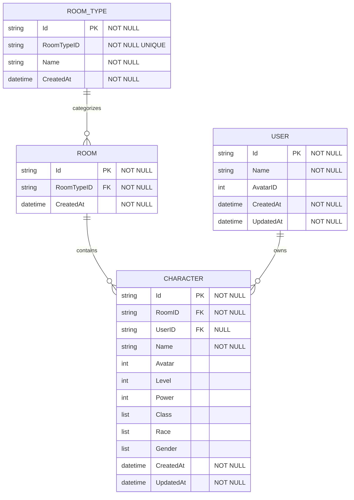
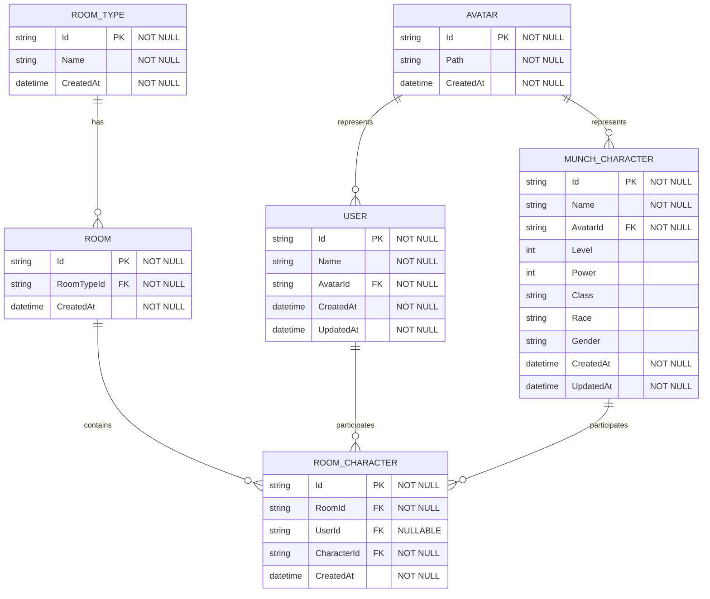
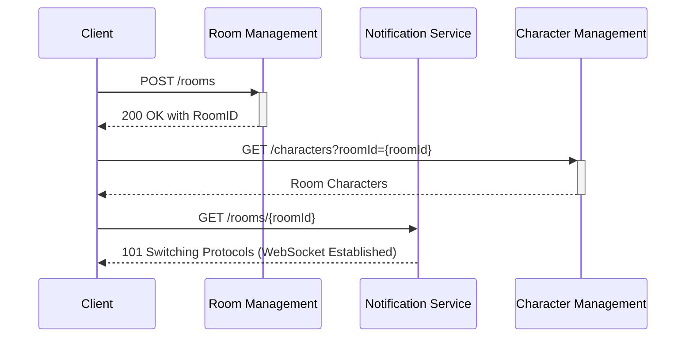
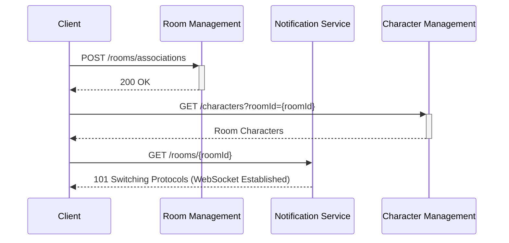

# Backend Services

# Services

[User Management](Backend%20Services/User%20Management.md)

[Room Management](Backend%20Services/Room%20Management.md)

[Room Notifications](Backend%20Services/Room%20Notifications.md)

[Character Management](Backend%20Services/Character%20Management.md)

# Database Schemas

## Actual Database Schema

## Proposed Database Schema

# Flows

## Create Room Flow

## Join Room Flow

