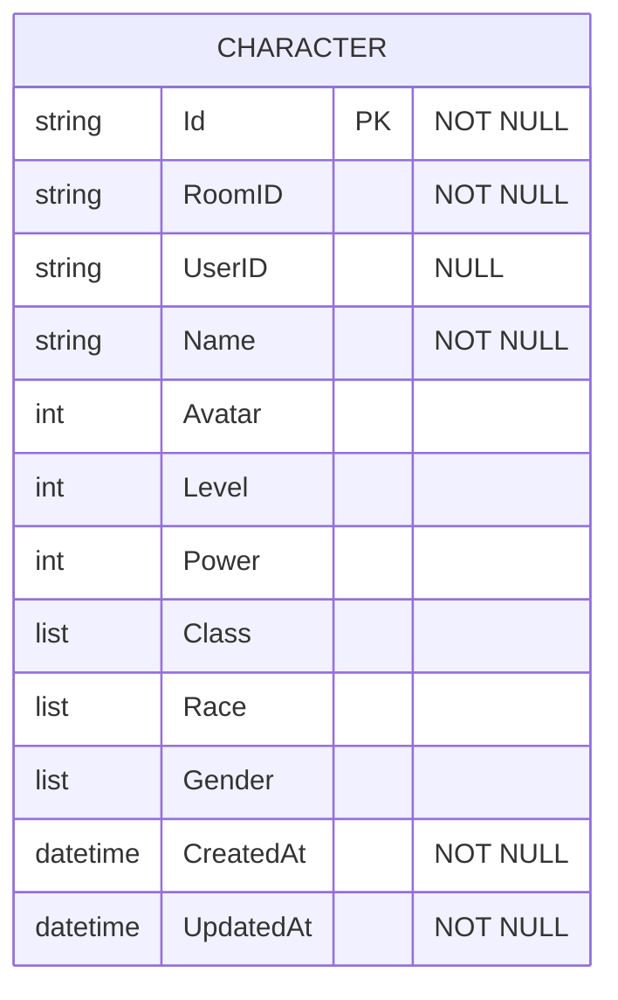
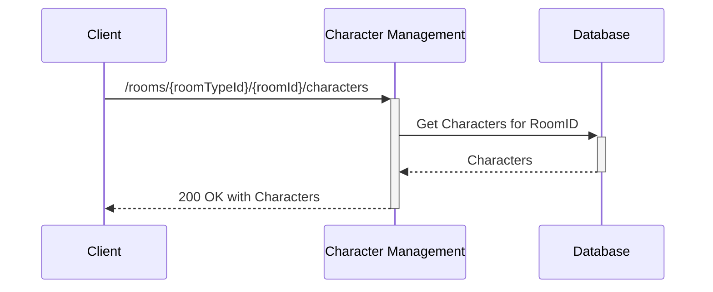
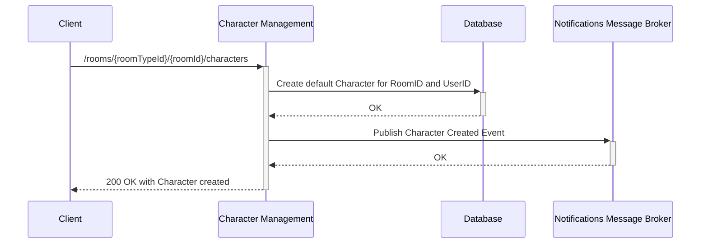
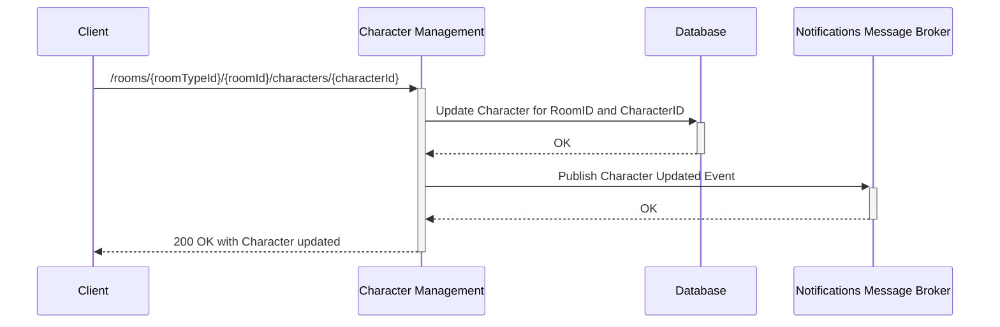
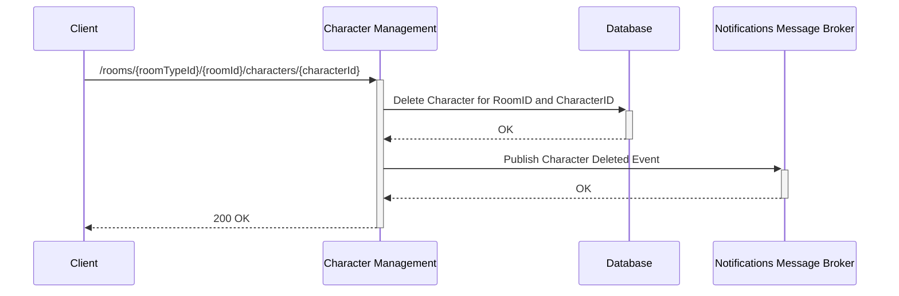

# Character Management

Service responsible for managing characters in rooms, including creating, updating, and deleting characters. Each character is associated with a user and a room, and has attributes such as name, avatar, level, power, class, etc.

# Database Schema

# API Endpoints

**Global initial Path**: `/rooms/<RoomTypeId>/<RoomId>/characters`

**Type**: `HTTP`

## Get Characters

**Description**: Get all characters in a room

**Path**: `/rooms/<RoomTypeId>/<RoomId>/characters` 

**Type**: `HTTP`

**Method**: `GET`

**Input**: None

**Output**:

- `characters` : Array of Characters in a Room
    - `Id`: Character Id
    - `Name`: Character Name
    - `Avatar`: Character Avatar
    - `Level`: Current level
    - `Power`: Current Power
    - `Class`: Array of current classes
    - `Race`: Array of current races
    - `Gender`: Array of current genders

**Flow**:

## Create a Character

**Description**: Create a character in a room

**Path**: `/rooms/<RoomTypeId>/<RoomId>/characters` 

**Type**: `HTTP`

**Method**: `PUT` 

**Input**:

- `Name`: Name for the new character
- `Avatar`: Avatar for the new character

**Output**:

- `Id`: Character Id
- `Name`: Character Name
- `Avatar`: Character Avatar
- `Level`: Default level
- `Power`: Default Power
- `Class`: Array of default classes
- `Race`: Array of default races
- `Gender`: Array of default genders

**Flow**:

## Update a Character

**Description**: Update any parameters of a character in a room

**Path**: `/rooms/<RoomTypeId>/<RoomId>/characters/<CharacterId>` 

**Type**: `HTTP`

**Method**: `POST`

**Input**:

- `Name`: (Optional) Character Name
- `Avatar`: (Optional) Character Avatar
- `Level`: (Optional) New Level
- `Power`: (Optional) Default Power
- `Class`: (Optional) Array of default classes
- `Race`: (Optional) Array of default races
- `Gender`: (Optional) Array of default genders

**Output**:

- `Id`: Character Id
- `Name`: Character Name
- `Avatar`: Character Avatar
- `Level`: New Level
- `Power`: Default Power
- `Class`: Array of default classes
- `Race`: Array of default races
- `Gender`: Array of default genders
- `CreatedAt`: Character creation timestamp
- `UpdatedAt`: Character last update timestamp

**Flow**:

## Delete a Character

**Description**: Delete a character in a room

**Path**: `/rooms/<RoomTypeId>/<RoomId>/characters/<CharacterId>` 

**Type**: `HTTP`

**Method**: `DELETE`

**Input**: None

**Output**: `200 OK`

**Flow**:

