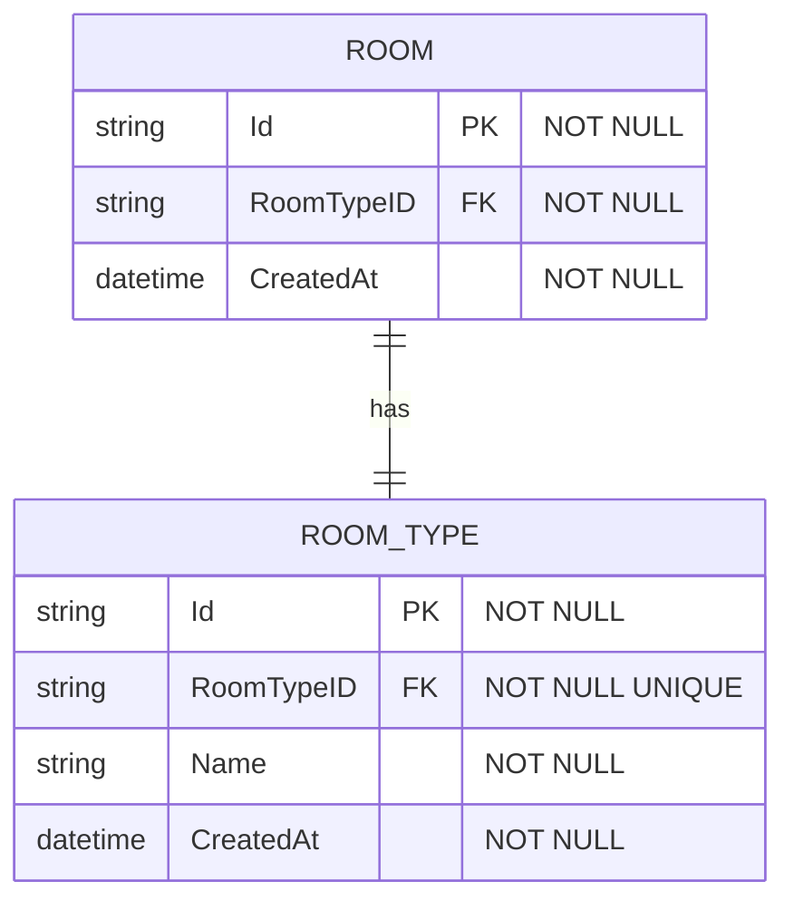
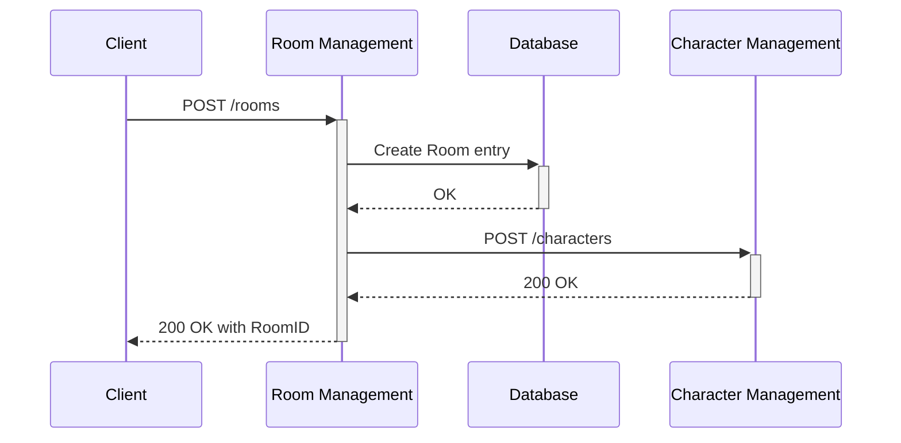
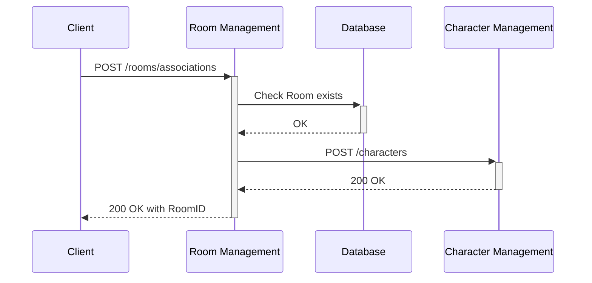

# Room Management

Room Management Service is responsible for creating and managing rooms in Munch Helper. It provides APIs for creating and joining rooms. Currently only `munchkin` room type should be supported.

# Database Schema

# API Endpoints

**Global initial Path**: `/rooms` 

**Type**: `HTTP`

## Create Room

**Description**: Creates a Room of `RoomTypeID`, Initializes it with a User with `UserID` and Returns `RoomID`.

**Path**: `/rooms`

**Method**: `POST`

**Inputs**:

- UserID

**Outputs**:

- RoomID

**Flow**:

## Join Room

**Description**: Joins a Room of `RoomTypeID` and `RoomID` with a User with `UserID`.

**Path**: `/rooms/associations`

**Method**: `POST`

**Inputs**:

- UserID

**Outputs**:

- RoomID

**Flow**:

