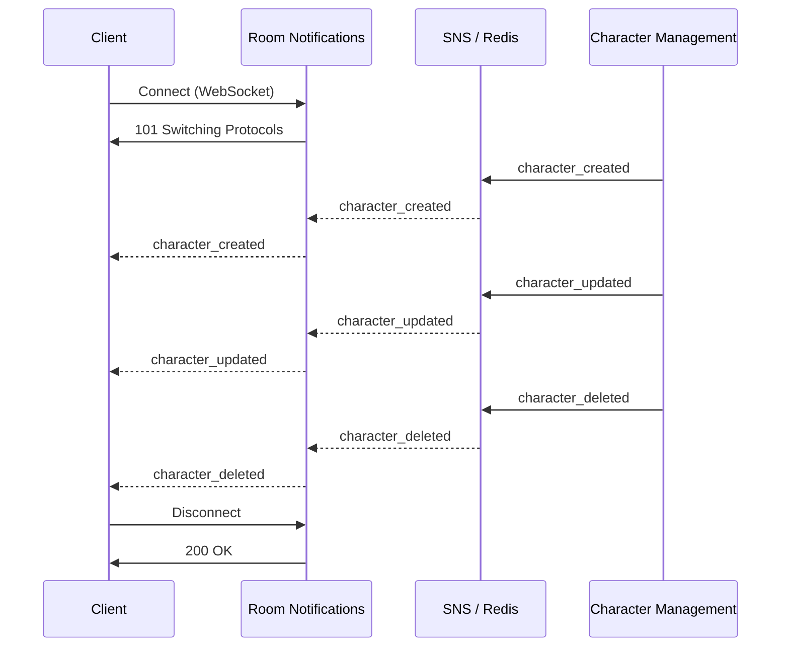

# Room Notifications

Room Notifications Service sends real-time events to clients subscribed to a room.

Cloud transport uses AWS API Gateway WebSocket + AWS Lambda + AWS SNS.
Local transport uses native WebSocket server + Redis Pub/Sub.

# Flow


# API Endpoints

Cloud WebSocket endpoint is API Gateway WebSocket URL with required query params.
Local WebSocket endpoint path includes room id.

**Type**: `WebSocket`

## Connect

**Description**: Creates a WebSocket connection

**Cloud URL**: `wss://<WebSocketApiId>.execute-api.<region>.amazonaws.com/ws?roomId=<RoomId>&userId=<UserId>`

**Local URL**: `ws://localhost:8084/rooms/<RoomId>?userId=<UserId>`

**Method**: WebSocket

**Inputs**: `RoomId`, `UserID`

**Outputs**: `101 Switching Protocols` (WebSocket Established)

## Disconnect

**Description**: Close a WebSocket connection

**Path**: Same WebSocket connection used by connect

**Method**: WebSocket

**Inputs**: None

**Outputs**: `200 OK`

# Notifications Events

## Character Created

**Event structure**:

```json
{
	"event": "character_created",
	"event_body": {
		"characterId": "string"
	}
}
```

## Character Updated

**Event structure**:

```json
{
	"event": "character_updated",
	"event_body": {
		"characterId": "string"
	}
}
```

## Character Deleted

**Event structure**:

```json
{
	"event": "character_deleted",
	"event_body": {
		"characterId": "string"
	}
}
```
