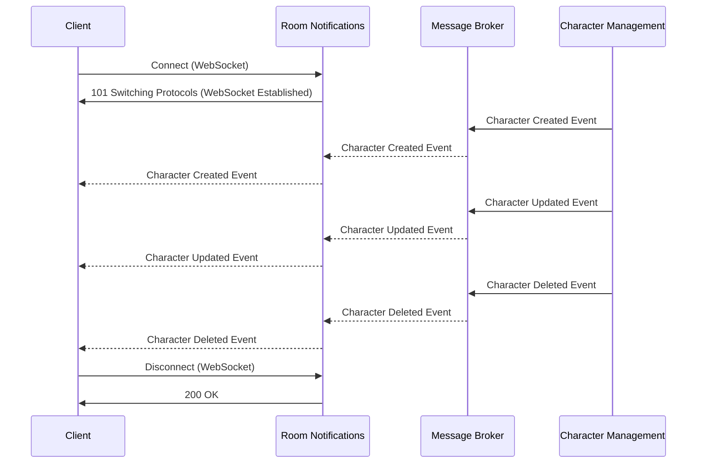

# Room Notifications

Room Notifications Service is responsible for sending real-time notifications to clients subscribed to a room.

# Flow


# API Endpoints

**Global initial Path**: `/rooms/<RoomId>`

**Type**: `WebSocket`

## Connect

**Description**: Creates a WebSocket connection

**Path**: `/rooms/<RoomId>`

**Method**: WebSocket

**Inputs**: `UserID`

**Outputs**: `101 Switching Protocols` (WebSocket Established)

# Disconnect

**Description**: Close a WebSocket connection

**Path**: `/rooms/<RoomId>`

**Method**: WebSocket

**Inputs**: None

**Outputs**: `200 OK`

# Notifications Events

## Character Created

**Event structure**:

```json
{
	"event": "character_created",
	"event_body": {
		"characterId": "string"
	}
}
```

## Character Updated

**Event structure**:

```json
{
	"event": "character_updated",
	"event_body": {
		"characterId": "string"
	}
}
```

## Character Deleted

**Event structure**:

```json
{
	"event": "character_deleted",
	"event_body": {
		"characterId": "string"
	}
}
```
