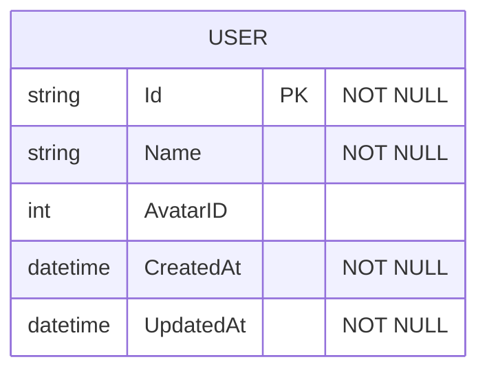
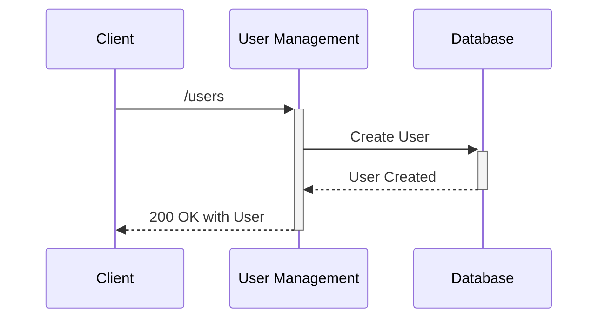
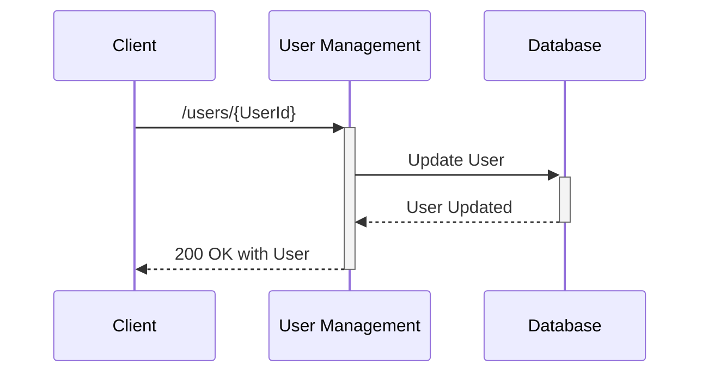

# User Management

Service responsible for managing Users in the system, including creating and updating User profiles.

# Database Schema

# API Endpoints

**Global initial Path**: `/users` 

**Type**: `HTTP`

## Create User

**Description**: Creates a User with random parameters, and returns a User structure

**Path**: `/` 

**Method**: `POST`

**Inputs**: None

**Outputs**:

- `ID`: unique id of the user
- `Name`: nickname of a user
- `AvatarID`: id of an avatar

**Flow**:

## Update User

**Description**: Updates User profile with new parameters, and returns a User structure

**Path**: `/<UserId>`

**Method**: `POST`

**Inputs**:

- `ID`: User ID of the User to update
- `Name` (can be `null`): User name to update
- `AvatarID` (can be `null`): User Avatar to update

**Outputs**:

- `ID`: unique id of the user
- `Name`: nickname of a user
- `AvatarID`: id of an avatar

**Flow**:
