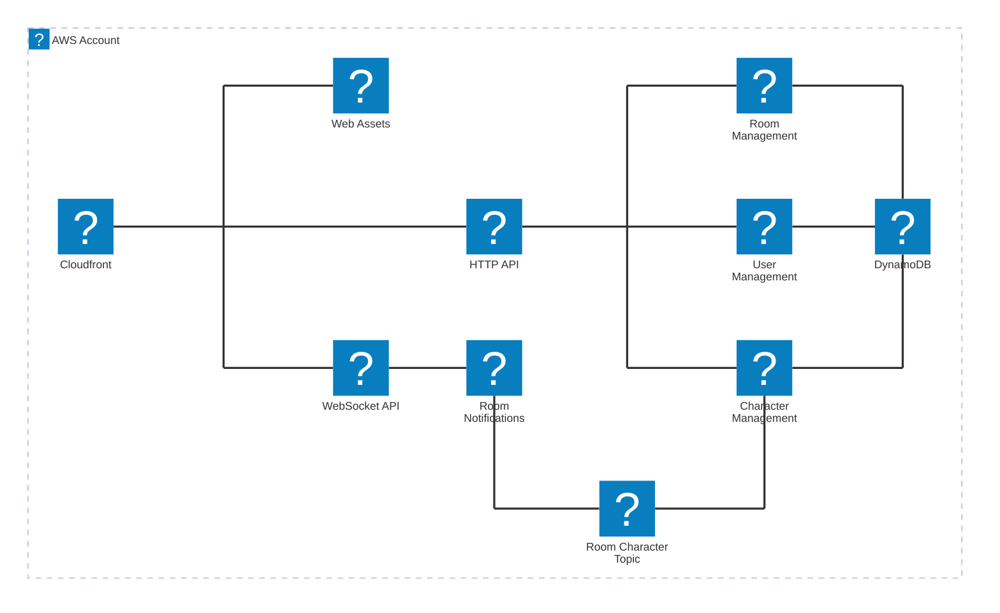

# AWS Diagram

The diagram goes from left to right.

```mermaid-js
architecture-beta
    group account(logos:aws)[AWS Account]

    service cloudfront(logos:aws-cloudfront)[Cloudfront] in account
    service s3(logos:aws-s3)[Web Assets] in account
    service httpApi(logos:aws-api-gateway)[HTTP API] in account
    service wsApi(logos:aws-api-gateway)[WebSocket API] in account
    junction cfOrigins in account
    junction cfOriginS3 in account
    junction cfOriginHttpApi in account
    junction cfOriginWsApi in account

    cloudfront:R -- L:cfOrigins

    cfOrigins:T -- B:cfOriginS3
    cfOriginS3:R -- L:s3

    cfOrigins:R -- L:cfOriginHttpApi
    cfOriginHttpApi:R -- L:httpApi

    cfOrigins:B -- T:cfOriginWsApi
    cfOriginWsApi:R -- L:wsApi

    service roomManagement(logos:aws-lambda)[Room Management] in account
    service userManagement(logos:aws-lambda)[User Management] in account
    service characterManagement(logos:aws-lambda)[Character Management] in account
    service roomNotifications(logos:aws-lambda)[Room Notifications] in account

    wsApi:R -- L:roomNotifications

    junction httpApiIntegrations in account
    junction httpApiIntegrationRoomManagement in account
    junction httpApiIntegrationCharacterManagement in account

    httpApi:R -- L:httpApiIntegrations

    httpApiIntegrations:T -- B:httpApiIntegrationRoomManagement
    httpApiIntegrationRoomManagement:R -- L:roomManagement

    httpApiIntegrations:R -- L:userManagement

    httpApiIntegrations:B -- T:httpApiIntegrationCharacterManagement
    httpApiIntegrationCharacterManagement:R -- L:characterManagement

    service dynamoDb(logos:aws-dynamodb)[DynamoDB] in account
    junction roomManagementDb in account
    junction userManagementDb in account
    junction characterManagementDb in account

    roomManagement:R -- L:roomManagementDb
    userManagement:R -- L:userManagementDb
    characterManagement:R -- L:characterManagementDb

    roomManagementDb:B -- T:dynamoDb
    userManagementDb:R -- L:dynamoDb
    characterManagementDb:T -- B:dynamoDb

    service roomCharacterTopic(logos:aws-sns)[Room Character Topic] in account
    junction characterManagementTopic in account
    junction roomNotificationsTopic in account

    characterManagement:B -- T:characterManagementTopic
    roomNotifications:B -- T:roomNotificationsTopic
    roomNotificationsTopic:R -- L:roomCharacterTopic
    characterManagementTopic:L -- R:roomCharacterTopic
```
